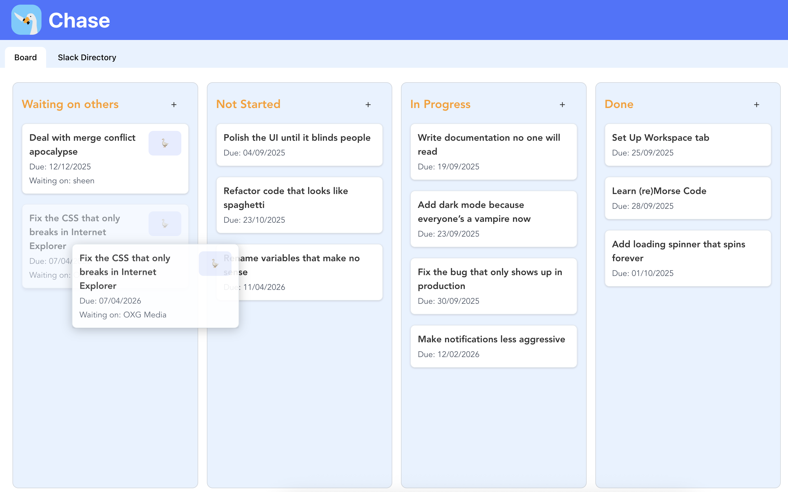
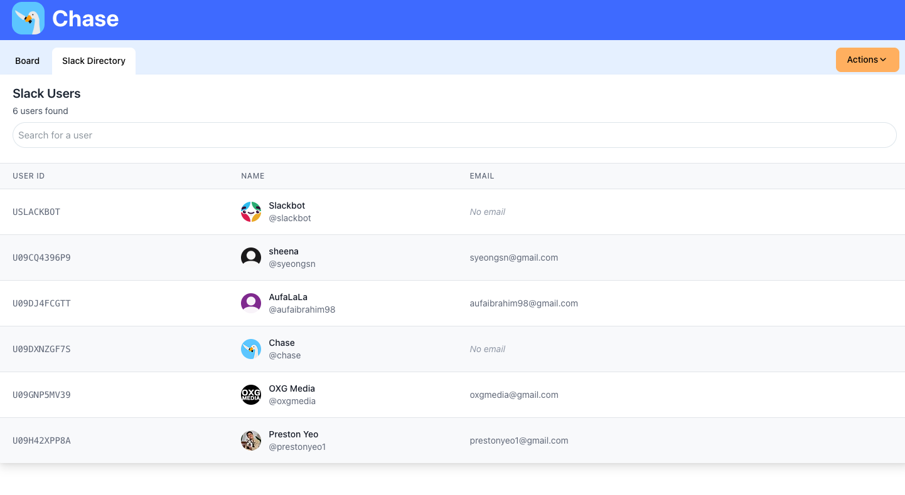
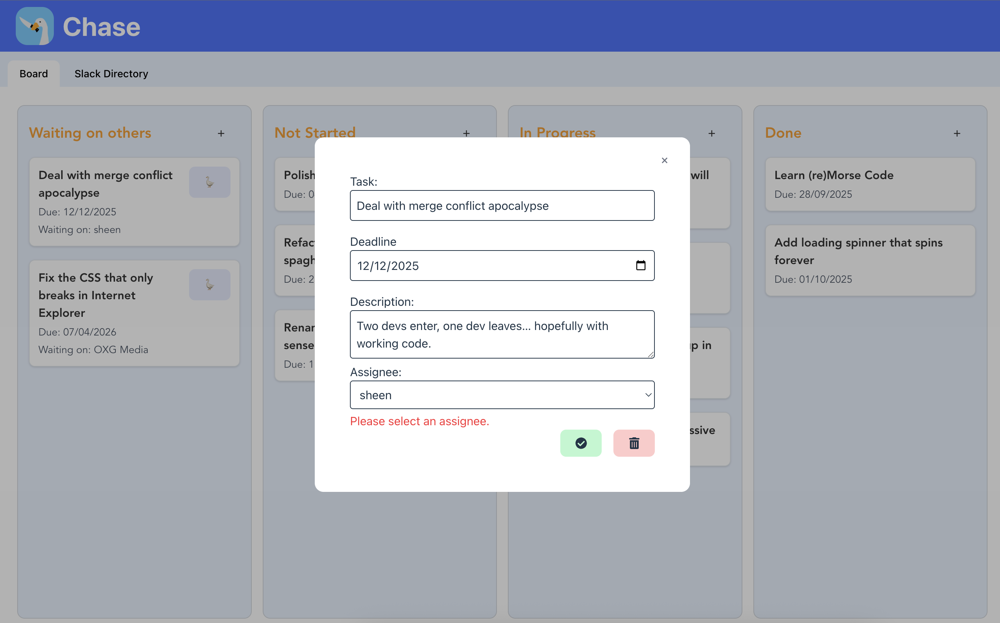
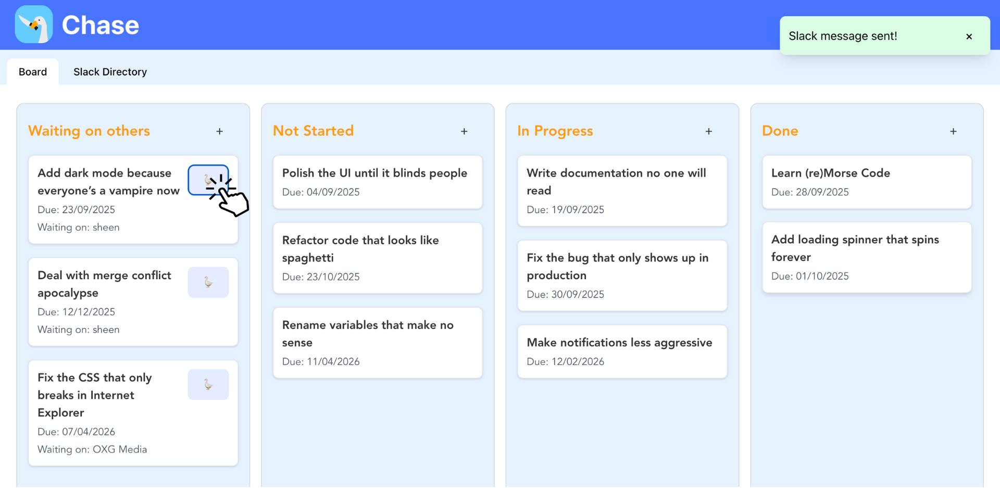
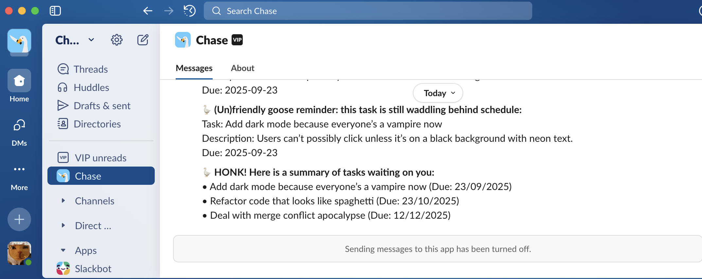

# Chase - Kanban Task Manager

A web-based Kanban board built with **React (Vite)** and deployed on **Railway**. It provides a simple drag-and-drop interface for managing tasks across customizable columns. 
Visit the live application: https://outstanding-abundance-production.up.railway.app/

  

## Features

**Task Management**

- Create, Edit, and Delete Tasks - Easily manage your tasks with a clean, intuitive interface
- Drag and Drop - Move tasks between columns (To Do, In Progress, Done) with smooth drag-and-drop functionality
- Assign to Users - Link tasks to team members pulled directly from your Slack workspace
- Chase Users - Click a button to send formatted task details to the assignee via Chase bot DM
- Refine Chase Message with AI - Hover on the Chase button to access options to customise your message, or use the help of AI to refine it
- Task Summary - Generate and send a comprehensive summary of all tasks assigned to a specific user with one click

**Data & Integration**

- Persistent Storage - All tasks are saved via backend API connected to Airtable
- Slack Integration - Send task updates directly to users with one tap
  - Send individual task notifications
  - Share daily/weekly task summaries
  - Direct messaging to assigned team members

## Screenshots
**Kanban Board**: Drag and drop tasks between columns

**Slack Directory**: View all team members and send task summaries via Slack

**Task Details**: Create and edit tasks with assignee selection

**Slack Integration**: Chase bot sends formatted task messages and summaries to assignees with one tap

**AI Integration**: Draft chaser messages with one click

## Attributions

- [React Icons](https://react-icons.github.io/react-icons/) (`react-icons/fa`)
- [Radix UI Toast](https://www.radix-ui.com/primitives/docs/components/toast)
- [Headless UI](https://headlessui.com/)
- [React DnD](https://react-dnd.github.io/react-dnd/about)

## Tech Stack

- **Frontend:** React + Vite + TailwindCSS + ReactDnD
- **Backend:** Node.js + Express.js
- **Database:** Airtable
- **APIs:** Slack API, Gemini API
- **Deployment**: Railway

## Next Steps
- TypeScript: Run program in TypeScript instead
- OAuth: Add OAuth and have individual boards for each user
- Redis caching: Cache frequently accessed data (tasks, users) to reduce Airtable API calls
- Database migration: Move from Airtable to PostgreSQL/MongoDB for more control and scalability
